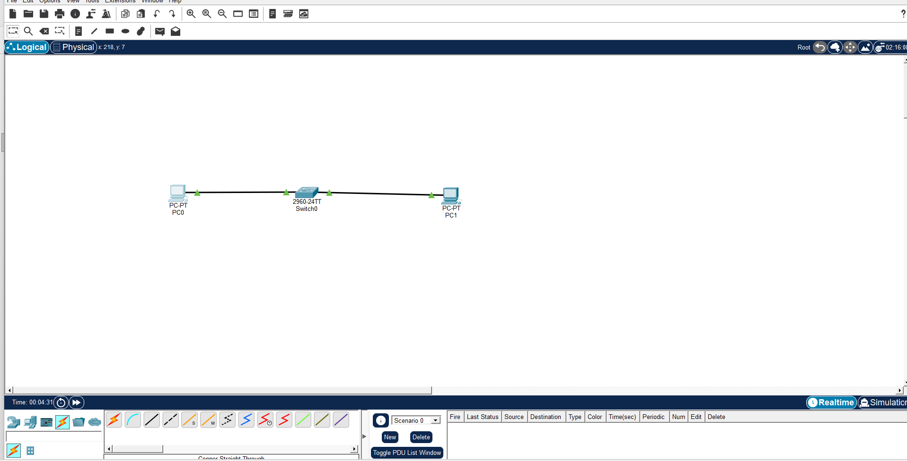
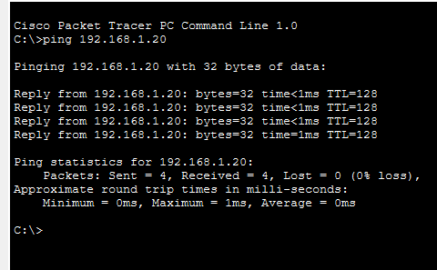
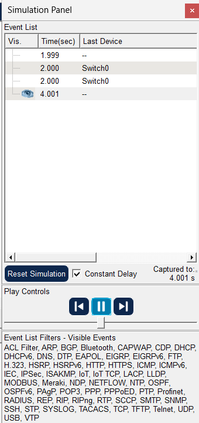

**Project Overview**
This project demonstrates the design, deployment, and validation of a fundamental Local Area Network (LAN) using a centralized Star Topology. The purpose of this lab is to establish physical and logical connectivity between end devices using a hardware switch, assign a static IPv4 addressing scheme, and verify error-free data transmission via the network command-line interface (CLI) and visual packet simulations.

 **Network Components & Topology Design**
 The network architecture is built using an industry-standard star layout, ensuring that if an individual end-point link fails, the rest of the network environment remains completely unaffected.
 Central Switch: 1 x Cisco Catalyst 2960
 SwitchEnd Devices: 2 x Workstation PCs (PC0 and PC1)
 Media / Cabling: Copper Straight-Through Cables (Ethernet)
 **Physical Connections:**
 PC0 (FastEthernet0) -> Switch0 (FastEthernet0/1)
 PC1 (FastEthernet0) -> Switch0 (FastEthernet0/2)
 

  **Logical Addressing Schema (IPv4)**
  A static, classless private IP addressing structure was planned and applied to the interface configurations to ensure local routing compatibility without data conflicts.
  Device Name(PC0) Interface(FastEthernet0) IPv4 Address(192.168.1.10)  Subnet Mask(255.255.255.0)
  Device Name(PC1) Interface(FastEthernet0) IPv4 Address(192.168.1.20)  Subnet Mask(255.255.255.0)
                 

   **Implementation & Verification Steps**
**1. Link Status Validation**
Upon establishing physical connections, link negotiations were observed. The interface indicators transitioned systematically from Amber (Spanning Tree Protocol listening and learning phases) to Green (Forwarding state), confirming an active Layer 1 and Layer 2 link status across all connected switch ports.

**2. Command Line Connectivity Testing (Ping)**
To verify end-to-end logical connectivity at Layer 3, the ping utility was executed from the Command Prompt terminal of PC0 targeting PC1 (192.168.1.20).

Execution Commands and Obresved Output:

**3. Visual Simulation Analysis**
**Project Overview**
This project demonstrates the design, deployment, and validation of a fundamental Local Area Network (LAN) using a centralized Star Topology. The purpose of this lab is to establish physical and logical connectivity between end devices using a hardware switch, assign a static IPv4 addressing scheme, and verify error-free data transmission via the network command-line interface (CLI) and visual packet simulations.

 **Network Components & Topology Design**
 The network architecture is built using an industry-standard star layout, ensuring that if an individual end-point link fails, the rest of the network environment remains completely unaffected.
 Central Switch: 1 x Cisco Catalyst 2960
 SwitchEnd Devices: 2 x Workstation PCs (PC0 and PC1)
 Media / Cabling: Copper Straight-Through Cables (Ethernet)
 **Physical Connections:**
 PC0 (FastEthernet0) -> Switch0 (FastEthernet0/1)
 PC1 (FastEthernet0) -> Switch0 (FastEthernet0/2)
 

  **Logical Addressing Schema (IPv4)**
  A static, classless private IP addressing structure was planned and applied to the interface configurations to ensure local routing compatibility without data conflicts.
  Device Name(PC0) Interface(FastEthernet0) IPv4 Address(192.168.1.10)  Subnet Mask(255.255.255.0)
  Device Name(PC1) Interface(FastEthernet0) IPv4 Address(192.168.1.20)  Subnet Mask(255.255.255.0)
                 

   **Implementation & Verification Steps**
**1. Link Status Validation**
Upon establishing physical connections, link negotiations were observed. The interface indicators transitioned systematically from Amber (Spanning Tree Protocol listening and learning phases) to Green (Forwarding state), confirming an active Layer 1 and Layer 2 link status across all connected switch ports.

**2. Command Line Connectivity Testing (Ping)**
To verify end-to-end logical connectivity at Layer 3, the ping utility was executed from the Command Prompt terminal of PC0 targeting PC1 (192.168.1.20).

Execution Commands and Obresved Output:

**3. Visual Simulation Analysis**
Using Cisco Packet Tracer's Simulation Mode, a Protocol Data Unit (PDU) envelope was tracked through the network. The visual flow successfully mapped the packet traveling from PC0 up to the central Switch0, down to its target destination PC1, and returning smoothly back to the origin source with an explicit acknowledgment indicator.
The Event List captured the transmission timeline meticulously, tracking the packet's path through Switch0 at Layer 2, validating the lookup of destination MAC addresses, and recording a final state capture at the 4.001s mark

**Key Skills Demonstrated**
1.Comprehensive understanding of the OSI Model (Layer 1 Physical Media, Layer 2 Switching, Layer 3 IP Addressing).

2.Practical deployment of a functional Local Area Network infrastructure.

3.Proficiency in using network diagnostics utilities (ping) to troubleshoot and verify connectivity.

4.Familiarity with simulated hardware management systems and structural cabling standards.

.

2.Practical deployment of a functional Local Area Network infrastructure.

3.Proficiency in using network diagnostics utilities (ping) to troubleshoot and verify connectivity.

4.Familiarity with simulated hardware management systems and structural cabling standards.
